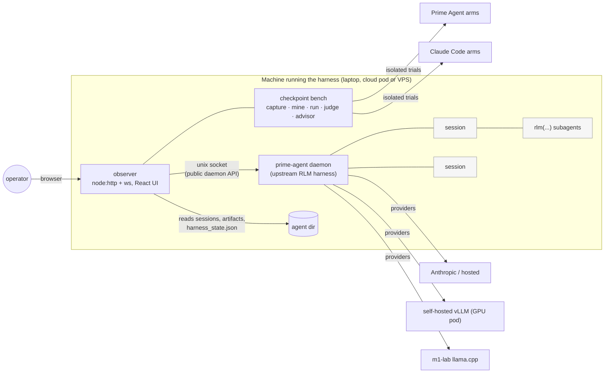

<h1 align="center">prime-agent-eray</h1>

<p align="center">
  <strong>Observing, benchmarking and deploying a self-improving agent harness for long-horizon work</strong>
</p>

<p align="center">
  <a href="#what-this-fork-adds">What it adds</a> &bull;
  <a href="#checkpoint-benchmarks">Checkpoint benchmarks</a> &bull;
  <a href="#first-results">First results</a> &bull;
  <a href="#quick-start">Quick start</a> &bull;
  <a href="#research-direction">Research direction</a> &bull;
  <a href="UPSTREAM_README.md">Upstream README</a>
</p>

<p align="center">
  <a href="LICENSE"></a>
  
  
  <a href="https://github.com/PrimeIntellect-ai/prime-agent"></a>
  
</p>

---

Autonomous LLM agents are now run for hours or days in a loop. When those runs go wrong they
rarely fail loudly: a tool call fails silently, state goes stale, a credential expires, and the
final output still looks plausible. You cannot improve a long-running agent you cannot see, and
you cannot trust a harness change you have not measured.

This repository is my working lab for that problem. It is a fork of
[Prime Intellect's **Prime Agent**](https://github.com/PrimeIntellect-ai/prime-agent), an
open-source *self-improving RLM harness* (persistent Python REPL as the only model tool,
recursive `rlm(...)` subagents, daemon-backed background sessions, and a *Continual Harness*
that refines its own prompts, memories and skills). On top of it I built three things:

1. **An observer**: a web UI that shows what every agent in a fleet is doing, live and after the fact.
2. **Checkpoint benchmarks**: a way to freeze real moments from real sessions and test harness
   changes against them, next to the unmodified harnesses, instead of assuming they help.
3. **Infrastructure to run it unattended**: containerised deployment to cloud CPU/GPU machines and
   a VPS, local and self-hosted model providers, and operator-in-the-loop skills for the steps only
   a person can do.

> The core RLM harness and its paper are Prime Intellect's work (see [Credits](#credits)). Everything
> described below as *added* is mine.

## What this fork adds

| Area | What it does | Where |
|---|---|---|
| **Observer** | Sidecar web UI over the harness daemon. Fleet signal board, RLM spawn-tree **lineage**, per-session page hosting the real agent terminal (xterm.js over a PTY), agent-to-agent **comms**, Continual Harness entries with refinement **diffs and rollback**, schedules and heartbeats, ops console with one-click redeploy. Never modifies harness state it does not own. | [`observer/`](observer/) |
| **Checkpoint benchmarks** | Capture a moment from a live session, mine finished sessions for major decisions, generate skill variants, run them as arms against raw Prime Agent and raw Claude Code, judge against explicit criteria, re-run on a schedule, and let an **advisor** inject winning skills into live sessions. | [`observer/src/server/bench/`](observer/src/server/bench/) |
| **Operator-in-the-loop skills** | `human` (ask / choose / hand off steps such as verification codes or identity checks, depth-gated so subagents cannot prompt the operator) and `purchase` (budgeted spending where every purchase needs the operator's approval). | [`packages/coding-agent/skills/`](packages/coding-agent/skills/) |
| **Deployment** | One container image for the daemon + observer, supervised with restart-on-redeploy; RunPod CPU pod with a network volume, a GPU pod serving a self-hosted model with vLLM, a flat-rate VPS sandbox, and a pull-only folder binding back to the laptop. | [`deploy/`](deploy/) |
| **Model providers** | Self-hosted vLLM, an OpenAI-compatible hosted provider, and `m1-lab`: llama.cpp on a 64 GB Apple-silicon lab machine exposed to the harness as a provider. `PRIME_MODEL_ONLY` pins a sandbox to one provider. | [`deploy/models.json`](deploy/models.json), [`deploy/m1-lab/`](deploy/m1-lab/) |
| **Stress tests** | Written reports for every deployment and harness change, including the failures each one surfaced. | [`deploy/stress-test-*.md`](deploy/) |

## Architecture



## Checkpoint benchmarks

Harness changes such as a new skill, a new prompt or a new memory are easy to believe in and hard to
measure. Checkpoint benchmarks turn real trajectories into repeatable tests.

1. **Capture.** Freeze a session at an anchor (a user message or mid-turn): the transcript up to that
   point as a forkable session, harness memory **rewound to the anchor time** (so a trial can never
   read notes the original session wrote about its own solution), settings, and the workspace from a
   shadow-git recorder that snapshots on every user message.
2. **Specify.** A helper drafts the goal, required and optional final-state criteria, and judge
   instructions. The operator's desired trajectory is kept judge-only, and everything is editable.
3. **Mine.** A finished session is windowed into major decisions (with screenshots), and each can
   become a task.
4. **Experiment.** Describe a change and get *N* variants as `SKILL.md`. Arms are
   harness × variant × model × memory mode (`snapshot`, `current`, `none`), always including the
   **raw** Prime Agent and **raw** Claude Code baselines. A variant is inserted identically on both
   harnesses.
5. **Run and judge.** Each trial gets an isolated agent dir and its own daemon (Prime Agent) or a fresh
   private config dir (Claude Code). A read-only judge scores the final workspace from a git diff, and
   required criteria are enforced server-side. Every run records repo commit, harness version and a
   memory stamp, because these drift between scheduled re-runs.
6. **Advise.** Optionally, an advisor watches live sessions and, when a major step starts that a
   verified skill fits (it beats the raw arm by a margin), steers the skill in.

## First results

First live end-to-end run (2026-09-14, one task, one repeat per arm; full report in
[`deploy/stress-test-bench-2026-09-14.md`](deploy/stress-test-bench-2026-09-14.md)). The task came
from a real session: writing launch copy without first researching competitors.

| Arm | Passed | Score | Agent cost | Time |
|---|---|---|---|---|
| Prime Agent, raw | 0/1 | 0.05 | $0.043 | 11 s |
| Claude Code, raw | 0/1 | 0.05 | $0.090 | 16 s |
| Prime Agent + competitor-research skill | 0/1 | 0.55 | $0.217 | 133 s |
| Claude Code + competitor-research skill | 1/1 | 0.92 | $0.341 | 88 s |

Both raw harnesses skipped research and wrote a single option. With the skill, both researched live.
A single repeat is not evidence, and the more useful outcome was the set of failures the run exposed.
All four were fixed:

- **Trials shared the operator's OAuth login.** A trial refreshing its copy rotated the refresh token
  and silently logged out the operator's own daemon. Trials now get static credentials only.
- **Every old session looked active at boot**, so the recorder snapshotted all of them.
- **Advisor → detector feedback loop.** The advisor's own injected message was captured as a new
  benchmark request, so the system was creating tasks from its own output.
- **A UI action called a CLI command that no longer existed upstream.**

These are exactly the kind of quiet, compounding failures long-running agent systems produce, and
they motivate the research direction below.

## Quick start

Requirements: Node 22+, Python 3.11+ (with [`uv`](https://docs.astral.sh/uv/)), git.

```bash
git clone https://github.com/erikcik/prime-agent-eray.git
cd prime-agent-eray
npm ci && npm run build            # upstream harness
./prime-agent.sh                    # interactive agent (see UPSTREAM_README.md for auth/providers)

# observer
cd observer && npm install && npm run build
PRIME_OBSERVER_TOKEN=$(openssl rand -hex 24) ../deploy/run-observer.sh   # http://127.0.0.1:8790
```

Deployment guides: [`deploy/README.md`](deploy/README.md) (container + RunPod),
[`deploy/README-vllm.md`](deploy/README-vllm.md) (self-hosted model on a GPU pod),
[`deploy/m1-lab/README.md`](deploy/m1-lab/README.md) (Apple-silicon lab machine),
[`deploy/vps/vps.sh`](deploy/vps/vps.sh) (VPS sandbox).

Tests: `cd observer && npm run check && npm test` (126 tests; the server boots against a fixture agent
dir with the daemon offline).

## Repository layout

```
packages/          upstream Prime Agent (RLM harness, TUI, providers)  + skills/human, skills/purchase
observer/          observer web UI and checkpoint benchmarks            (added)
deploy/            image, entrypoint, pods, VPS, m1-lab, stress-test reports (added)
UPSTREAM_README.md the original Prime Agent README
```

## Research direction

**What breaks in long-horizon LLM agent loops?** Multi-day runs fail through chains of small events
(a silent tool failure, then stale state, then an expired credential, then a confident but wrong
result) rather than one obvious error. My next step is to:

1. log structured failure events from long runs of this harness,
2. build a taxonomy of those events,
3. test whether failures cascade in a consistent **order**, treating a run log as a noisy event
   sequence, and
4. check whether the inferred stage predicts that a run is going to fail earlier than a timeout or an
   error count does.

This is also the subject of my final-year project at the University of Sussex.

## Credits

The RLM harness, the Continual Harness and everything under `packages/` (except the two skills noted
above) come from [Prime Agent](https://github.com/PrimeIntellect-ai/prime-agent) by
[Prime Intellect](https://primeintellect.ai), building on [pi](https://github.com/badlogic/pi-mono)
by Mario Zechner. The upstream paper is [arXiv:2608.23552](https://arxiv.org/abs/2608.23552). Their
original README is preserved in [`UPSTREAM_README.md`](UPSTREAM_README.md).

Fork additions by **Eray Baydemir** ([@erikcik](https://github.com/erikcik)), University of Sussex.

## License

MIT, as upstream. See [LICENSE](LICENSE).
